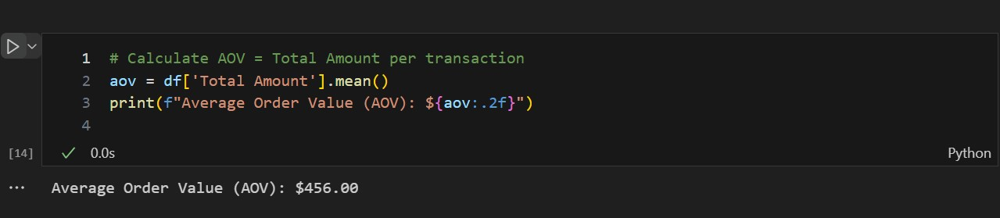
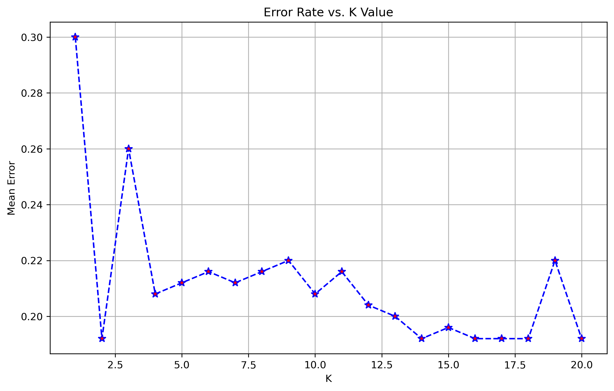
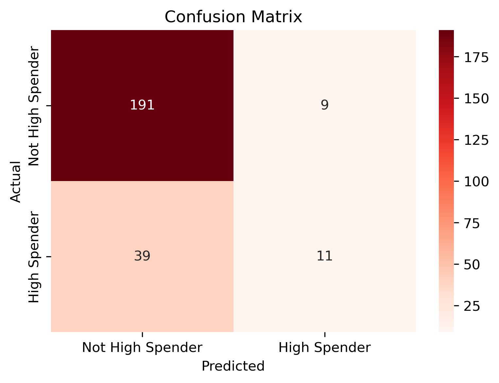

# Retail Sales Dataset Project

This project is part of the Data Science Certificate program at the University of Toronto’s Data Sciences Institute.

## Dataset

We are using the [Retail Sales Dataset](https://www.kaggle.com/datasets/mohammadtalib786/retail-sales-dataset), which contains transactional-level sales data including information such as the date of purchase, customer gender and age, the type of product bought (product category), how many items were purchased, the price per item, and the total revenue generated from each transaction. This data allows us to explore shopping patterns and customer behavior across different groups.

The raw dataset is stored in the `data/raw/` directory.

## Team Members

- Iryna Verbova ([iverbova](https://github.com/iverbova))
- Tetiana Hakansson ([t125yf](https://github.com/t125yf))
- Rabia Imra Kirli Ozis ([rabiaimra](https://github.com/rabiaimra))
- Ting Man ([manntintin](https://github.com/manntintin))
- Vrushali Patil ([vrushalipatil9763](https://github.com/vrushalipatil9763))

## Business Problem

This project investigates purchasing behavior in the context of a small to medium-sized retail business. We aim to explore how **customer demographics** (age and gender) and **product features** (category and price) affect purchasing patterns.

Specifically, we are exploring:
- How sensitive different age groups and genders are to **price changes**.
- Whether it's possible to **identify high-spending customers** based on transaction attributes.

The outcomes will help retail stakeholders make **more informed pricing decisions**, **segment customers**, and **design targeted marketing strategies**.

## Stakeholders

The primary stakeholders who will benefit from this project include:
- **Retail business owners and managers** looking to better understand customer behavior and optimize sales performance
- **Marketing teams** designing promotions and loyalty programs
- **Pricing analysts** interested in understanding how different customer groups respond to price changes

These stakeholders are focused on improving profitability, increasing customer retention, and delivering more targeted, data-driven customer experiences.

---

## Business Questions

1. **Regression Question**: Price Sensitivity by Customer Segment 
   _Can we predict whether price per unit affects the quantity purchased differently across age groups or genders?_  
   → This helps us identify which customer segments are more **price sensitive**, supporting smarter pricing decisions.

2. **Classification Question**: Identifying High-Spending Customers
   _Can we classify whether a customer will be a high spender based on their demographics and purchase details?_  
   → This enables **targeted marketing and personalized engagement** with valuable customers.

---

## Initial Dataset Review

- The dataset is **clean, well-structured, and ready for analysis**.
- No missing values or duplicates.
- `Total Amount` is consistent with `Quantity × Price per Unit`.
- Categorical fields (`Gender`, `Product Category`) are well-defined and usable.
- Contains sufficient diversity in ages, product categories, and purchase amounts, making it suitable for exploring both regression and classification questions.

## Methods & Technologies

- Python (pandas, NumPy)
- Data Visualization (matplotlib, seaborn)
- Feature Engineering (pandas, one-hot encoding, quantile thresholds)
- GitHub (collaboration and version control)
- Multiple Linear Regression Model (statsmodels, sklearn)
  

## Risks and Uncertainties

- The dataset may lack granularity for some modeling tasks.
- The sample size is relatively small (1,000 rows), which may affect the accuracy and reliability of our classification models.
- A small sample size in a regression model can lead to unreliable coefficient estimates, inflated standard errors, and reduced statistical power, making it difficult to detect true relationships between variables.
- Since the dataset used in this project is synthetic, it may not fully capture the complexity, variability, and noise present in real-world data, which could limit the generalizability of our model's performance.
- There is a risk of overfitting if too many derived features are included without careful validation.
- Relationships between variables (e.g., age, gender, and quantity purchased) may be weak or non-linear, which can reduce model effectiveness.

---

## Tasks & Timeline

| Team Member | Task |
|-------------|------|
| Iryna       | Data exploration, feature engineering |
| Imra        | Conducting regression modeling |
| Vrushali    | Conducting classification modeling |
| Tetiana     | Writing conclusions, maintaining narrative |
| Mandy       | Presentation development |

---

##  Data Exploration

We take an initial look at the Retail Sales Dataset to uncover patterns and trends and provide valuable insights that will guide future analysis.

Objectives:

- Examine the structure and contents of the dataset
- Create exploratory visualizations to reveal patterns in purchasing behavior
- Produce statistical summaries to identify key trends

Hence, our main goal is to explore how factors like product price, product type, age, and gender influence customer buying habits and total sales performance.

**Dataset Overview**

We worked with a clean dataset of 1,000 retail transactions. The key features included product information, price, quantity, and demographic data like age and gender.

- `Transaction ID`: Unique identifier per transaction
- `Date`: Transaction date
- `Customer ID`: Anonymized customer identifier
- `Gender`: Customer gender
- `Age`: Customer age
- `Product Category`: Product type (Beauty, Clothing, Electronics)
- `Quantity`: Number of items purchased
- `Price per Unit`: Cost per item
- `Total Amount`: Transaction value = `Quantity × Price per Unit`
-  All columns are well-formatted. There are no missing or duplicate values, and the calculated field `Total Amount` is consistent with `Quantity * Price per Unit`.

 **Exploratory Data Analysis (EDA)**
- This section explores key patterns in the dataset through visualizations:
- Sales trends
- Purchase behavior by category, gender, and age
- Average order values and price comparisons by product categories

**Exploratory Insights**:
Understanding these patterns can help businesses adjust pricing, better segment customers, and tailor campaigns more effectively.

 Sales Trend: Sales fluctuate across dates with noticeable spikes around mid-year:

Product Category: Electronics contributes the highest revenue, followed by Clothing and Beauty:

Gender Split: Females account for slightly higher overall sales compared to males:
- 
  

Age Groups: Customers aged 40-60 make the largest contribution, followed by those aged 25-40, who also significantly contribute to sales volume:
    
     
  
Average Order Value (AOV):  $456.00.

Price per Unit: Beauty items have the highest average price per unit, while Clothing is the most affordable category.
 

These findings will guide our feature engineering and modeling decisions in the next phase.

 
## Feature Engineering
 Turning Raw Data into Insightful Features
 
 To help our models make better predictions, we first needed to enhance the dataset by creating new, more informative features — this process is called feature engineering. We transformed the original retail data into features that could be used in further analysis. 
 These new features help our models recognize patterns more clearly, such as who is more likely to make large purchases or when sales tend to peak.

-We will generate all relevant features needed for our classification and regression models, including:
- Categorical encodings
- Temporal features
- Interaction-ready variables
- Target variable for classification

At the end, we’ll export a clean `processed_data.csv` to be used for modeling.

To simplify linear regression modeling, we also create numeric encodings for:
- Gender: Male = 0, Female = 1
- Age Group: `<25` = 1, `25-40` = 2, `40-60` = 3, `60+` = 4
- Product Category: Clothing = 1, Electronics = 2, Beauty = 3

| Feature                         | Type                                     | Reason                                                                                 |
|---------------------------------|------------------------------------------|----------------------------------------------------------------------------------------|
| Age Group                       | Categorical                              | Needed to evaluate interaction effects between age and price in regression. Binned into <25, 25-40, 40-60, 60+ for business relevance. |
| High Spender                    | Binary                                   | Target variable for classification. Labeled as 1 if the transaction is in the top 25% of Total Amount. |
| Month                            | Numeric                                  | Temporal feature to explore monthly patterns or seasonality.                            |
| Day of Week                     | Numeric                                  | Helps identify weekday/weekend trends. Can be used to enrich predictions.               |
| Avg Price per Item              | Numeric                                  | Provides insight into pricing behavior per transaction.                                |
| Gender_*, ProductCategory_*, AgeGroup_* | One-hot encoded categorical vars         | Useful for classification models and non-linear ML algorithms. `drop_first=True` used to avoid dummy variable trap. |
| Gender_Num, AgeGroup_Num, ProductCategory_Num | Numeric (label encoded)               | Added to support regression models (linear models often benefit from single numeric representations of categories). |

 Example: 
From original:

Age = 43

Gender = Female

Product = Electronics

After Transformation:

Age Group = 40–60

Gender = 1

Product Code = 2

This is what feature engineering looks like — we convert human-friendly info into model-friendly numbers.

Our goal is to teach the model to recognize which customers are likely to spend more — so we created this target feature.

With our engineered dataset, we can move confidently into building models that provide useful insights for decision-making.

## Regression Model

To better understand the factors that drive product purchase quantity in a retail context, we developed a linear regression model using transactional data. The goal was to examine how unit price, customer demographics (age group and gender), and their interactions influence the quantity of items purchased in a single transaction.

**Our model:** 
Quantity = β0 + β1*(Price per Unit) + β2*(Age Group) + β3*(Gender) + β4*(Price per UnitAge Group) + β5*(Price per Unit*Gender) + ε

This specification allows us to capture both the main effects of price, age, and gender, and how these effects interact — particularly, whether price sensitivity differs by demographic group.

The interaction terms capture differential price sensitivity, such as how price impacts might vary between age groups or between male and female customers. This allows the model to go beyond average effects and identify segment-specific behavioral patterns, which are often crucial for effective targeting and personalization in modern retail strategies.

From an **industry perspective**, this type of model provides valuable insights into price sensitivity across different customer segments. For example:

- Personalized pricing and promotions: Marketing teams can use insights from interaction terms to identify which segments (e.g., age 25–40) are more price-sensitive and target them with dynamic pricing or customized discounts.

- Demand forecasting: Understanding which demographic groups are more responsive to price helps inventory planners and analysts model future sales volumes more accurately under different pricing strategies.

- Segmentation analysis: The model provides evidence-based support for customer segmentation strategies by quantifying behavioral differences in purchase patterns across age and gender groups.

- Strategic decision-making: Retailers can use such models to inform store-level pricing, online targeting, and cross-channel optimization efforts based on predicted consumer responsiveness.

While the model’s predictive power is limited, it offers a foundational framework for interpreting customer behavior and can be expanded by incorporating additional variables such as seasonality, product-level features, loyalty data, or promotional history. In real-world applications, such models could be integrated into business intelligence dashboards or dynamic pricing systems to support evidence-based decision-making.

**OLS Regression Results**

| **Metric**         | **Value**     | **Metric**          | **Value**   |
|--------------------|---------------|---------------------|-------------|
| Dep. Variable      | Quantity      | R-squared           | 0.014       |
| Model              | OLS           | **Adj. R-squared**  | **0.002**   |
| Method             | Least Squares | F-statistic         | 1.172       |
| Date               | Fri, 18 Jul 2025 | Prob (F-statistic) | 0.310       |
| Time               | 19:39:29      | Log-Likelihood      | -1148.1     |
| No. Observations   | 750           | AIC                 | 2316        |
| Df Residuals       | 740           | BIC                 | 2362        |
| Df Model           | 9             | Covariance Type     | nonrobust   |
                                        
---

**Coefficients Table**

| Variable                 | coef   | std err | t      | P>\|t\| | [0.025   | 0.975]   |
|--------------------------|--------|---------|--------|---------|-----------|----------|
| const                    | 2.1543 | 0.163   | 13.184 | 0.000   | 1.834     | 2.475    |
| Price per Unit           | 0.0017 | 0.001   | 2.715  | 0.007   | 0.000     | 0.003    |
| Gender_Num               | 0.0658 | 0.113   | 0.584  | 0.559   | -0.155    | 0.287    |
| Age Group_25-40          | 0.3823 | 0.188   | 2.038  | 0.042   | 0.014     | 0.750    |
| Age Group_40-60          | 0.3639 | 0.176   | 2.069  | 0.039   | 0.019     | 0.709    |
| Age Group_60+            | 0.1678 | 0.215   | 0.781  | 0.435   | -0.254    | 0.590    |
| Price_Age_25_40          | -0.0016| 0.001   | -2.285 | 0.023   | -0.003    | -0.000   |
| Price_Age_40_60          | -0.0019| 0.001   | -2.844 | 0.005   | -0.003    | -0.001   |
| Price_Age_60+            | -0.0010| 0.001   | -1.146 | 0.252   | -0.003    | 0.001    |
| Price_Gender_Interaction | -0.0003| 0.000   | -0.617 | 0.537   | -0.001    | 0.001    |

---

**Model Diagnostics**

| **Test**            | **Value**  | **Test**          | **Value**  |
|---------------------|------------|-------------------|------------|
| Omnibus             | 6041.210   | Durbin-Watson     | 1.949      |
| Prob(Omnibus)       | 0.000      | Jarque-Bera (JB)  | 57.838     |
| Skew                | 0.023      | Prob(JB)          | 2.76e-13   |
| Kurtosis            | 1.640      | Cond. No.         | 2.63e+03   |

Notes:
[1] Standard Errors assume that the covariance matrix of the errors is correctly specified.
[2] The condition number is large, 2.63e+03. This might indicate that there are
strong multicollinearity or other numerical problems.

**Model Objective:**

Predict Quantity purchased based on unit price, age group, gender, and their interactions.

**Model Fit:**
- R-squared: 0.014 → Model explains only 1.4% of variation in Quantity which shows weak explanatory power.

- Adjusted R-squared: 0.002

- F-statistic: 1.172, p-value: 0.310 → Model is not statistically significant overall. In other words, our predictors jointly do not explain the variation in Quantity at conventional significance levels (p > 0.05).

**Key Findings:**

- `Price per Unit`: Higher prices slightly increases quantity on average. The effect is small but statistically significant at 1% level. 

- `Gender` (Female vs. Male): No clear evidence of gender-based differences in purchase quantity.

- `Age Groups`: Customers aged 25–60 buy slightly more than those under 25.

- **Interaction Terms:**
- Higher prices reduce quantity more for age groups 25–60.

- No evidence of gender-based differences in price sensitivity.

- **Conclusions:**

 - Some individual coefficients, such as price per unit, age groups 25-40 and 40-60, and their interaction terms, are statistically significant which implies that they have significant explanatory power in explaining the quantity purchased.  

 - However, the overall model lacks predictive power with low R2 and F-statistic. Thus, our model is not explaining the variability in quantity well. Most of the variation is likely driven by factors not included in the model.

 - Interaction terms reveal age-based differences in price sensitivity.

 - Gender appears to have no meaningful effect on quantity purchased.

 - Interestingly, the regression model reports a positive and statistically significant main effect of price per unit, suggesting that - all else equal - higher-priced products are associated with larger quantities purchased. While this may seem counterintuitive from a classical demand perspective, it could reflect nonelastic or luxury-oriented purchasing behavior, or the presence of premium product categories where higher prices do not deter demand and may even be associated with perceived value.

 - However, the model also includes interaction terms between price and age group, and these show significant negative coefficients for customers aged 25–60. This indicates that for these segments, higher prices are associated with lower quantities purchased, aligning more closely with traditional downward-sloping demand behavior. In other words, price sensitivity does exist in the data, but it varies across customer segments.

- **Additional Notes**
- To assess the model's ability to generalize beyond the data it was trained on, we randomly split the dataset into a training set (75%) and a test set (25%). The results indicate that the model performs poorly on unseen data with considerable percentage error in predictions.

## Classification Model
To classify high-spending customers based on demographics (gender, age group) and purchase attributes (product category and quantity) using the K-Nearest Neighbors algorithm.

We are using the feature-engineered dataset that includes encoded categorical variables, numerical features, and a binary target variable High Spender.
High Spender Label: Top 25% of customers labeled as "High Spender"

Split Data: 75% for training the model, 25% for testing

Standardization: Adjusted features so they are comparable (important for distance-based models like KNN)
We defined a cutoff point (75th percentile):

Customers who spent more than this value were labeled as High Spenders (1)
Everyone else was labeled Not High Spenders (0)

This gave us a binary classification task. 

KNN compares distances between customers — it’s sensitive to feature scales.

So we standardized features using Z-score normalization: z= (x−μ)/σ 
 
This ensures no feature (like Quantity) dominates others (like Gender).

**Best value for K:**

To find the best number of neighbors (K), we plot the error rate for values between 1 and 20.
This helps us select the optimal k that balances bias and variance.

The best value of k is: 2

**Train KNN**

We create a KNN classifier using k neighbors after finding the best value for K by Hyperparameter Tuning.
KNN works by comparing each test point to the k closest training points and assigning the majority class among them.

**KNN Distance Calculations:**

Compute distance to all training points using Euclidean distance formula:

distance: $d = \sqrt{(x_1 - x_1')^2 + (x_2 - x_2')^2 + \dots + (x_n - x_n')^2}$

It picks K closest points from training set using the above distance.

For classification, KNN checks the most frequent class among the k nearest neighbors.

**Example:**

If k=5 and the nearest neighbors have labels [1, 0, 1, 1, 0] → the predicted label is 1 (majority).

In case of a tie, behavior depends on the implementation (e.g., some libraries break ties by choosing the class with the lower label).

**Confusion Matrix**

- This heatmap shows how well the classifier predicted the two classes:

True Positives (TP): 11 - Correctly predicted high spenders

True Negatives (TN): 191 - Correctly predicted non-high spenders

False Positives (FP): 9 - Non-high spenders misclassified as high

False Negatives (FN): 39 - High spenders missed by the model

It helps identify if the model is biased toward one class or struggles with imbalanced data.

**Model Performance Summary**

 Metric                              | Value                                                      |
| ----------------------------------- | ---------------------------------------------------------- |
| Best `k`                            | **2**                                                      |
| Accuracy                            | **80.8%**                                                  |
| Precision (High Spenders - Class 1) | **55%**                                                    |
| Recall (High Spenders - Class 1)    | **22%**                                                    |
| F1 Score (High Spenders)            | **31%**                                                    |

**Main Takeaways**:

The model achieves a solid overall accuracy of 80.8%, showing it generally performs well across the board.

However, it struggles with identifying actual high spenders, with a recall of only 22% — meaning many true high spenders go undetected. The model tends to be cautious in labeling someone as a high spender.

When it does predict a customer is a high spender, it's correct about 55% of the time — this is the precision.

The model leans toward predicting the majority class (non-high spenders), which is understandable given the imbalance in the data (only 50 out of 250 test cases are high spenders).

## Conclusion

This project explored how customer demographics and product features influence purchasing behavior in a retail setting. We analyzed patterns in spending and built models to predict both quantity purchased and likelihood of being a high spender.

- Data exploration revealed that electronics generated the most revenue, women spent slightly more than men, and customers aged 40–60 were the most active shoppers — useful insights for segmentation and marketing.

- By engineering new features —like grouping ages, labeling top spenders, and converting categories into numbers— we turned raw data into something much more useful for building predictive models.

- The regression model showed that price per unit, age groups 25–60, and their interaction terms were statistically significant, suggesting they help explain quantity purchased. However, the model had low R² and F-statistic, indicating limited overall predictive power — likely due to missing key factors not captured in the dataset.

- We also built a classification model using K-Nearest Neighbors to find high spenders. This model reached 81% accuracy overall, but it struggled to correctly identify many actual high spenders (just 22% recall), mostly due to class imbalance — there were simply more low spenders in the data.

- Although our models are based on a synthetic dataset, they demonstrate how data-driven tools can support retail strategy in the real world. For example:

   - Pricing teams could use price sensitivity insights by age or gender to adjust promotions.

   - Marketing teams could tailor outreach toward segments identified as high-value customers.

   - Customer analytics teams could apply similar models to real transaction data to predict spending behavior, enhance personalization, and improve customer lifetime value.

- With real-world data and ongoing refinement, these models could become part of a broader decision-support system, helping retailers make smarter, more targeted choices that improve both customer experience and business outcomes.
